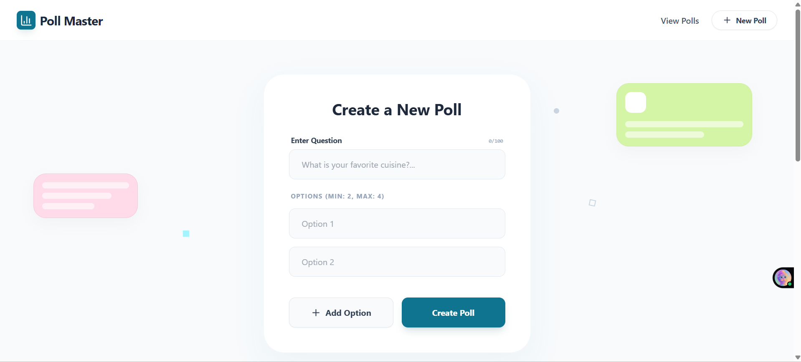
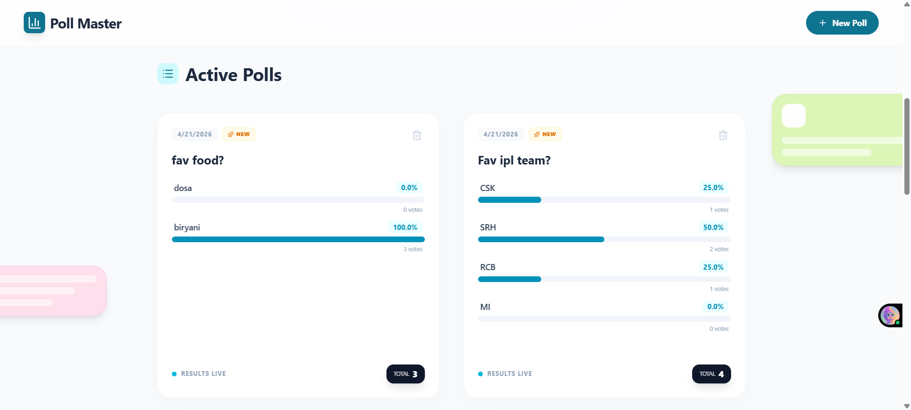

# Poll Master - Full Stack Voting Application

A real-time polling application built with **Flask** and **React**. Users can create polls with 2-4 dynamic options, cast votes, and view results with live-updating progress bars.

## 📸 App Preview

### 1. Creating a Poll


### 2. Viewing Results


## 🚀 Features
- **Dynamic Poll Creation:** Add/remove options (constrained to 2-4 as per requirements).
- **Live Results:** Visual progress bars with percentage calculation.
- **Production-Ready Storage:** Managed **MySQL (Aiven)** for persistence, with SQLite fallback for local development.
- **Duplicate Vote Prevention:** Client-side tracking using LocalStorage.
- **Professional UI:** Styled with Tailwind CSS principles and Lucide-React icons.
- **RESTful API:** Clean separation of concerns between Frontend and Backend.

## 🛠️ Tech Stack
- **Backend:** Python (Flask), Flask-SQLAlchemy, Flask-CORS, PyMySQL.
- **Frontend:** React (Vite), Axios, Lucide-React.
- **Database:** MySQL (Aiven) / SQLite (Local).

## 📐 Architectural Decisions & Implementation Notes
**1. Project Structure & Stack Choice**  
While the brief suggested a basic index.html/app.js structure, I opted for a Modern Full-Stack Architecture (React + Vite + Flask).

   - **Reasoning**: This allows for a more robust component-based UI, cleaner state management for the live-updating progress bars, and a decoupled RESTful API—all of which are industry-standard practices for scalable web applications.

**2. Client-Side Input Validation**
- **Strict Option Constraints**: The dynamic form enforces the 2-4 option requirement by conditionally disabling the "Add Option" and "Remove" actions.

- **Input Sanitization**: Frontend logic prevents the submission of empty questions or blank options, ensuring all poll data is meaningful.

- **Real-time Feedback**: A character counter is integrated into the UI to help users stay within database limits, preventing truncation errors.

**3. Security & Data Integrity**
- **Duplicate Vote Prevention**: Per the brief's "simple" requirement, I used LocalStorage to track votes. For a production environment, I would transition this to IP-based rate limiting or JWT-based session authentication to ensure higher integrity.

- **SQL Injection Protection**: I utilized Flask-SQLAlchemy (ORM) to ensure all database queries are parameterized, effectively neutralizing SQL injection vulnerabilities.

- **Sensitive Information**: Credentials for the database are handled via Environment Variables (see .env.example), ensuring that no sensitive connection strings are exposed in the version history.

**4. Database Configuration & Fallback**
The application is pre-configured for a Managed MySQL (Aiven) instance to ensure data persistence across server restarts.

- **Evaluation Ease**: To ensure the evaluator can run the project immediately, the system features a graceful fallback—if no MySQL credentials are found in the .env, the app automatically initializes a local SQLite database.


## 📁 Project Structure
- **/backend**: Flask API, database models, and PyMySQL integration.

- **/frontend**: React components, dynamic forms, and Tailwind-styled UI.

- **api.js**: Centralized API configuration for easy deployment switching.


## 🏃‍♂️ How to Run

### 1. Backend Setup
1. Navigate to the backend folder:
```bash
cd backend
```
2. Create and activate a virtual environment:

```bash
python -m venv venv
# Windows:
venv\Scripts\activate
# Mac/Linux:
source venv/bin/activate
```
3. Install dependencies:

```bash
pip install Flask Flask-Cors Flask-SQLAlchemy PyMySQL cryptography
```
4. Setup Environment Variables
```bash
# Copy the example file and add your MySQL credentials
cp .env.example .env
```

5. Start the Flask server:

```bash
python app.py
```
The API will be running at http://127.0.0.1:5000

### 2. Frontend Setup
1. Open a new terminal and navigate to the frontend folder:

```bash
cd frontend
```
2. Install dependencies:

```bash
npm install
```
3. Start the Vite development server:

```bash
npm run dev
```
Open the URL provided in the terminal (usually http://localhost:5173).


## 📝 Evaluation Requirements Met
- **Functionality**: Create, vote, and delete operations fully operational.

- **Data Aggregation**: Real-time percentage math and total vote tracking.

- **Persistence**: Data survives server restarts via Managed MySQL.

- **UX**: Dynamic 2-4 option fields and responsive progress bars.

- **Security**: Prevention of duplicate voting and SQL injection protection (via SQLAlchemy).

## 🗒️Note
 - The live demo is hosted on Render's free tier. If the page appears blank, please wait 30–60 seconds for the backend to wake up, then refresh.
